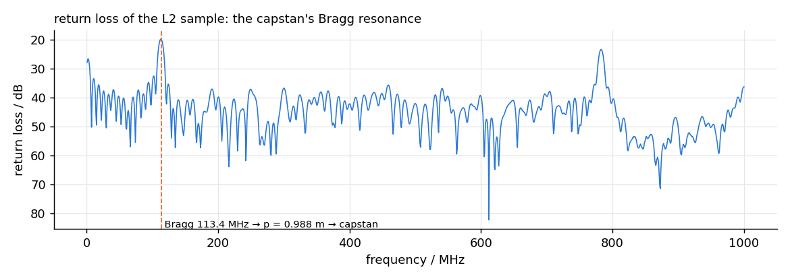
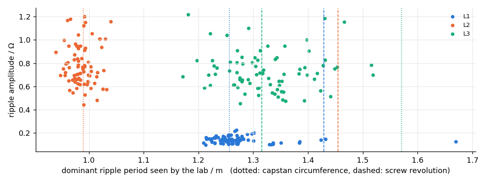
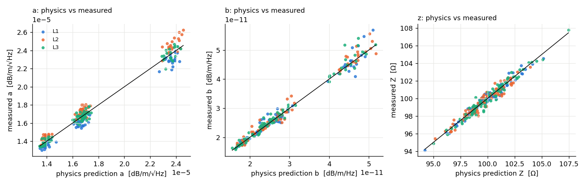
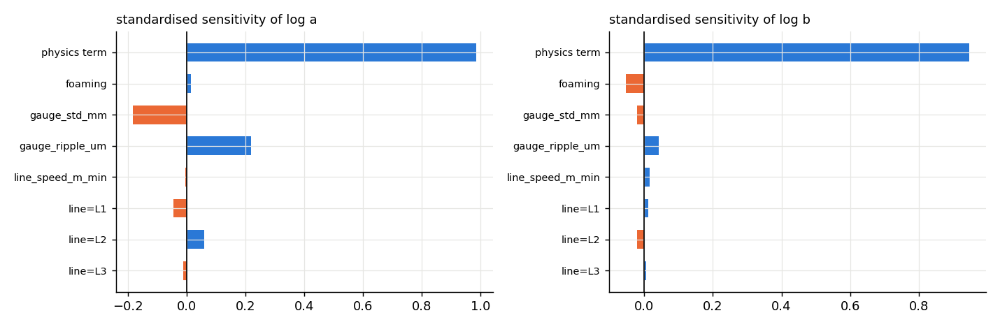
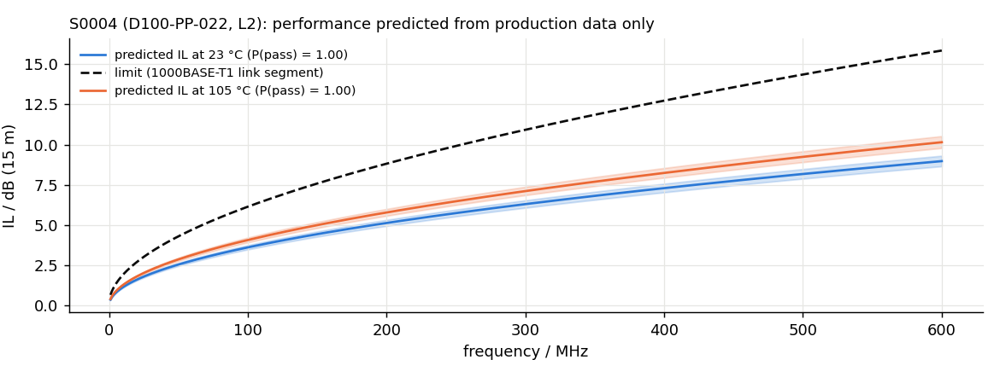

\newpage

# Purpose

A cable measurement is a thousand numbers. What the laboratory, the production line and the customer actually reason about are three: how much of the loss comes from the conductor, how much from the dielectric, and what the low-frequency floor is. This project builds the analytics layer that turns the measurements of Projects A and D into those numbers and then *uses* them in four ways:

1. fits the loss shape to every measurement, with a robust estimator and a covariance, so that each sample carries its own uncertainty;
2. sweeps temperature in the climate chamber and turns the fits into a derating model with the material coefficients that the physics predicts — so that a room-temperature measurement can be projected to the 105 °C a car imposes, with a margin against the limit and a maximum permissible length;
3. correlates the fitted numbers with how the cable was built (alloy, conductor and insulation diameters, foaming degree) and with the extrusion line's in-line gauge data, through a physics-informed model that is compared with a black-box learner under leave-lot-out cross-validation; and
4. detects the periodic reflection signature that a worn capstan or extruder screw leaves in the cable, from the return loss (Bragg resonance) or the impedance profile, and attributes it to a specific machine element from the line's parameters.

The stretch goal — predicting a cable's high-frequency performance from production data before it is measured, with a probability of passing the limit at temperature — falls out of 2 and 3 together.

As in the earlier projects, the data are synthetic: a production data set of 240 samples from three lines and four designs is generated from the physics of Section 2 with the nuisances a real plant has (per-line stranding factors nobody has written down, occasional dielectric contamination of a lot, gauge noise, laboratory fit uncertainty), and the laboratory path is exercised on Touchstone files produced by Project A's multiconductor model. The results are therefore statements about the *method*; the numbers that matter for a real plant come from re-running it on real files, for which every entry point exists.

# Physics

## Loss shape and its two bases

Per unit length, in dB/m, the insertion loss of a lossy line with $R(f) = R_\text{dc} + R_s\sqrt f$ and $G(f) = \omega C\tan\delta$ is, to first order in the losses,

$$
\mathrm{IL}(f) = c_0 + a\sqrt f + b f,\qquad
c_0 = 8.686\,\frac{R'_\text{dc}}{2Z_d},\quad
a = 8.686\,\frac{k_\text{prox}\sqrt{\mu_0\rho/\pi}}{d_c Z_d},\quad
b = 8.686\,\frac{\pi\sqrt{\varepsilon_\text{eff}}\tan\delta_\text{eff}}{c_0},
$$

with $\rho$ the conductor resistivity, $d_c$ its diameter, $k_\text{prox}$ the proximity/stranding factor, $Z_d$ the differential impedance, $\varepsilon_\text{eff}$ and $\tan\delta_\text{eff}$ the effective dielectric constants of the (foamed) insulation. This is the **physical basis**. The cabling standards use instead the empirical **standard basis** $a\sqrt f + bf + c/\sqrt f$ [@iec61156; @ieee8023bp]. Both describe a measured curve to hundredths of a dB; only the physical one can be *interpreted*. On the synthetic 15 m foamed-PE pair the standard basis fits the curve with 0.023 dB rms and returns $b$ 98 % too small and $a$ 6 % too large, because its $1/\sqrt f$ term cannot represent the DC constant and the other two terms absorb it; the physical basis fits with 0.007 dB rms and recovers $a$ to 0.1 % and $b$ to 1.6 % (Table 1). The package therefore fits the physical basis by default and offers the standard one for limit-line work.

## Design to properties

For a twisted pair whose insulated wires touch, $Z_d = (120/\sqrt{\varepsilon_\text{eff}})\operatorname{arccosh}(D/d_c)$ and $v = c_0/\sqrt{\varepsilon_\text{eff}}$. Foaming by a gas fraction $\phi$ enters through the Lichtenecker rule $\varepsilon_\text{eff} = \varepsilon_s^{\,1-\phi}$ and an empirical $\tan\delta_\text{eff} = \tan\delta_s(1-\phi)\varepsilon_s^{-\phi/2}$. Four alloys (Cu-ETP, CuAg0.1, CuSn0.3, CuMg0.2) and three insulations (PE, PP, FEP) carry their resistivity, loss tangent and temperature coefficients [@haynes2016]:

$$
\rho(T) = \rho_{20}\big(1 + \alpha_\rho (T - 20)\big),\quad
\tan\delta(T) = \tan\delta_{20}\big(1 + \beta_d (T - 20)\big),\quad
\varepsilon(T) = \varepsilon_{20}\big(1 + \gamma_e(T - 20)\big),
$$

so that $a(T) = a_{20}\sqrt{1 + \alpha_\rho\Delta T}\cdot Z_{20}/Z(T)$ and $b(T) = b_{20}(1 + \beta_d\Delta T)\sqrt{\varepsilon(T)/\varepsilon_{20}}$.

## Periodic defects

A periodic impedance variation of period $p$ produces a Bragg resonance in the return loss at

$$
f_B = \frac{v}{2p}\qquad(\text{and harmonics } n f_B),
$$

with a depth that grows with the number of periods in the sample and the relative impedance ripple: $|\Gamma_B| \approx \tfrac12\,(\Delta Z/Z)\,(L/p)$. The production line imprints periods that follow from its geometry and speed: one revolution of the capstan is $p = \pi d_\text{capstan}$; one revolution of the extruder screw is $p = v_\text{line}/(\text{rpm}/60)$; the take-up reel's circumference grows as it fills and therefore cannot imprint a *stationary* period over a whole sample, which is the discriminator that keeps it out of most attributions. A diameter ripple $\Delta D$ becomes an impedance ripple through $\Delta Z/Z = g(D/d_c)\,\Delta D/D$ with $g = (D/d)/\big(\sqrt{(D/d)^2-1}\,\operatorname{arccosh}(D/d)\big)\approx 1$.

# The loss fit

`cableanalytics.lossfit.fit_loss` is a weighted least-squares fit, linear in the coefficients, with two refinements. *Robustness*: standing-wave ripple and the Bragg resonance put narrow spikes on $\mathrm{IL}(f)$ that are not loss; the fit is iteratively re-weighted with Huber weights $w_i = \min(1, k s/|r_i|)$ ($k = 1.5$, $s$ a MAD-based residual scale), which down-weights the spikes without discarding points by hand — a test plants a 0.6 dB spike and checks that $a$ and $b$ move by less than 1 % and 5 %. *Uncertainty*: the covariance $\mathbf C = s^2(\mathbf X^{\mathsf T}\mathbf W\mathbf X)^{-1}$ gives $\sigma_a$, $\sigma_b$, $\sigma_{c_0}$ and the correlation $\rho_{ab}$, which is $-0.98$ on a 5 MHz–1 GHz sweep because $\sqrt f$ and $f$ are nearly collinear over two decades; the production correlation weights every sample by its own $\sigma$.

| | $a$ | $b$ | $c_0$ | rms residual |
|---|---|---|---|---|
| model truth (23 °C) | $1.665\cdot10^{-5}$ | $2.291\cdot10^{-11}$ | 0.0087 | – |
| physical basis | $1.667\cdot10^{-5}$ (+0.1 %) | $2.255\cdot10^{-11}$ ($-1.6$ %) | 0.0088 | 0.007 dB |
| standard basis | $1.753\cdot10^{-5}$ (+5.3 %) | $3.11\cdot10^{-12}$ ($-86$ %) | $c = 0$ | 0.023 dB |

Table 1: the 23 °C fit of the synthetic 15 m pair (units dB/m/$\sqrt{\text{Hz}}$, dB/m/Hz, dB/m).

# Temperature derating

`temperature_sweep` produces one Touchstone file per chamber temperature ($-40$, 23, 85, 105, 125 °C) from the design physics through Project A's model, and `fit_derating` fits the material model to the five loss fits: $a^2$ is linear in $T$ (weighted by $\sigma(a^2) = 2a\sigma_a$) and gives $\alpha_\rho$; $b$ is linear in $T$ and gives $\beta_d$. On the synthetic Cu-ETP/foamed-PE pair the fitted $\beta_d = 4.93\cdot10^{-3}$/K matches the material's $5.0\cdot10^{-3}$/K to 1.5 %, and the fitted $\alpha_\rho = 3.59\cdot10^{-3}$/K is 9 % below copper's $3.93\cdot10^{-3}$/K — deliberately: the fit sees $a\propto\sqrt\rho/Z$ and the impedance rises 1.3 % between 20 and 105 °C as the foam's permittivity falls, so the *effective* coefficient is what a derating needs and what the model reports (the test asserts it within 15 % of the tabulated value and the report states why). The derating at 600 MHz is 1.108 at 85 °C, 1.141 at 105 °C and 1.173 at 125 °C; with the 1000BASE-T1 link-segment limit from Project A the model gives, for any length, the worst hot margin and the maximum length that still passes at temperature.

{width=100%}

# From the return loss to the machine

The 23 °C Touchstone file of the sample "made on line L2" carries a 0.6 % impedance ripple with the period of L2's capstan. `period_from_return_loss` finds the deepest dip that lies at least 6 dB below the 10th percentile of the return loss — the Bragg resonance stands out from the ordinary end-reflection ripple by its depth, not its prominence relative to a local baseline, which was the first (failed) design — checks for a fundamental at half its frequency and for harmonics, and converts it with the measured velocity: $f_B = 113.4$ MHz $\rightarrow p = 0.988$ m. `attribute` matches this against the line's candidate periods with harmonics up to 3: capstan $\pi\cdot0.315 = 0.990$ m (score 0.002), screw $80/55 = 1.455$ m, take-up reel (non-stationary, weak prior) — capstan, unambiguous. The same function works from the impedance profile of Project D (`period_from_profile`, a Hann periodogram restricted to periods above two resolution cells).

{width=90%}

On the full production data set the same logic separates the lines without being told which is which: L2's samples cluster at 0.99 m (worn capstan bearing, 5.5 µm ripple), L3's at 1.32 m (worn screw), L1's spread over both weak signatures (Figure 3), and the return-loss minima follow — 27 dB on L2, 30 dB on L3, at the 32 dB floor on L1.

{width=90%}

# Manufacturing to physics

## Data set

240 samples, 3 lines, 4 designs, 20 lots. The production columns are what the MES knows (alloy, nominal diameters with tolerance noise, foaming, line speed, screw rpm, capstan diameter), the gauge columns are statistics of a simulated in-line diameter log (mean, standard deviation, dominant period and its amplitude from a periodogram — the same code that would run on the live gauge stream), and the measured columns are what the laboratory reports (fitted $a$, $b$, $c_0$ with $\sigma$, fitted impedance, ripple period and amplitude, IL at 600 MHz, return-loss minimum). The truth columns are kept for validation only.

## Models

Three model families predict the laboratory's $a$, $b$ and $Z$ from production data alone:

* **P — physics only**: Section 2.2 with nominal stranding factor and nominal loss tangent; no fitting at all.
* **P+ — physics plus correction**: ridge regression in log space of the measured value on the physics prediction and the production features (foaming, gauge statistics, line speed, line indicators), which learns what the physics does not know — each line's stranding factor, systematic foaming effects — under *leave-lot-out* cross-validation so that the score is honest about a new lot.
* **ML — black box**: gradient-boosted trees on the raw features, same cross-validation, as a baseline that ignores the physics.

Prediction intervals are split-conformal: the 90 % interval half-width is the 90th percentile of the absolute cross-validated residual.

| target | model | $R^2$ (CV) | rel. RMSE | 90 % interval |
|---|---|---|---|---|
| $a$ | P physics | 0.972 | 3.3 % | ±5.3 % |
| $a$ | P+ physics + correction | 0.986 | 2.3 % | ±3.7 % |
| $a$ | ML boosted trees | 0.980 | 2.8 % | ±4.6 % |
| $b$ | P physics | 0.977 | 4.9 % | ±9.0 % |
| $b$ | P+ physics + correction | 0.979 | 4.8 % | ±8.4 % |
| $b$ | ML boosted trees | 0.974 | 5.3 % | ±8.7 % |
| $Z$ | P physics | 0.954 | 0.4 % | ±0.7 % |
| $Z$ | P+ physics + correction | 0.951 | 0.4 % | ±0.7 % |
| $Z$ | ML boosted trees | 0.936 | 0.5 % | ±0.8 % |

Three findings. The physics alone explains 95–98 % of the variance of all three targets — the value of having a model is that the correction has little left to do and can be trusted on a new lot. The correction halves the residual of $a$ (3.3 → 2.3 %), and its standardised coefficients say why: after the physics term (0.99), the largest contributions are the line indicators and the gauge ripple — the stranding factor that differs from line to line and that the physics assumed constant. The dielectric coefficient $b$ is *not* improved by either the correction or the black box, and the interval stays at ±8 %: the residual is the lot-level contamination of the loss tangent, which no production column carries. That is a concrete recommendation for the plant — an in-line measure of the dielectric (a capacitance/loss monitor on the extruder) is worth more for predicting $b$ than any amount of modelling. The boosted trees never beat the physics-informed model and are worse on $Z$, where a 0.4 % effect is below what 240 samples can teach a tree.

{width=100%}

{width=100%}

# Predicting performance before measurement

`predict_performance` composes the pieces: the P+ prediction of $a$, $b$ and $Z$ with intervals, the material temperature coefficients of the alloy and the insulation, the physical loss shape, and Project A's limit library. For a production row it returns $\mathrm{IL}(f, T)$ for a chosen length and temperature with a 5–95 % band from a log-normal Monte-Carlo over $a$ and $b$, the worst margin against the limit (overall and above 100 MHz, where temperature matters), and the probability of passing. For the 15 m link-segment limit the four synthetic designs pass at 23 and 105 °C with high-frequency margins of 2.1–4.0 dB; the design with the CuSn conductor and PP insulation is the closest (2.6 dB at 23 °C, 2.1 dB at 105 °C), which is what the physics would have said and what a purchasing decision needs.

{width=90%}

# Limitations

* Synthetic data throughout; the nuisances were chosen to be realistic in kind, not calibrated in size. The value of the physics-informed model relative to a black box will depend on how much of a real plant's variance the physics captures, which only the real data set can tell.
* The derating model treats $a$ and $b$ as separable in temperature; conductor and dielectric temperature effects are indeed separable in the shape, but the impedance shift with temperature is absorbed into an effective $\alpha_\rho$, as stated.
* The Bragg detector assumes the periodic defect dominates the return loss; two comparable periodicities produce two dips and the attribution reports the strongest, with the runner-up shown.
* The predictive model needs the fitted-coefficient history of the plant to be trained; the first months of a deployment are the P model alone, which is already within a few per cent.

# References

::: {#refs}
:::
